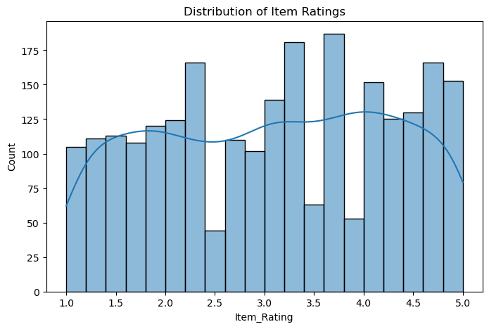
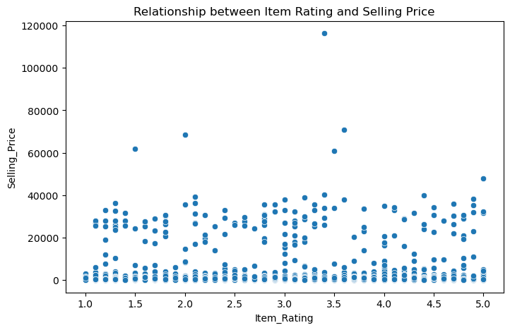
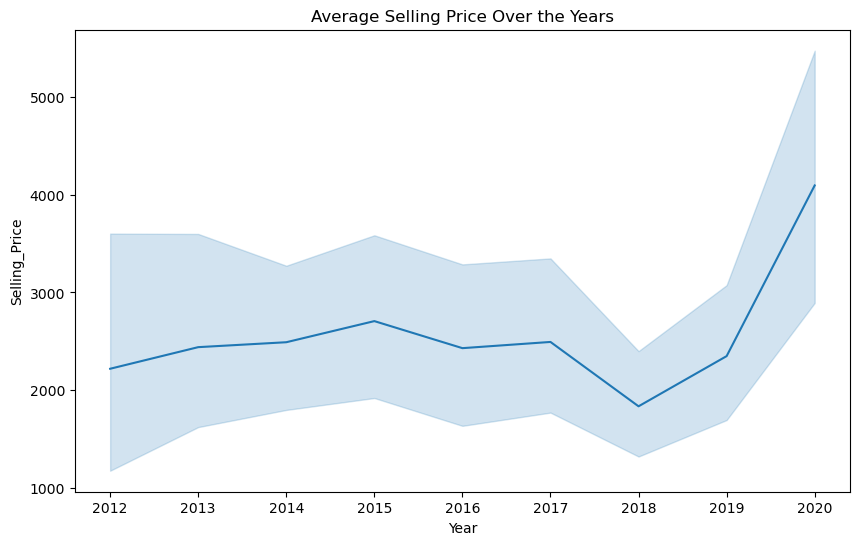
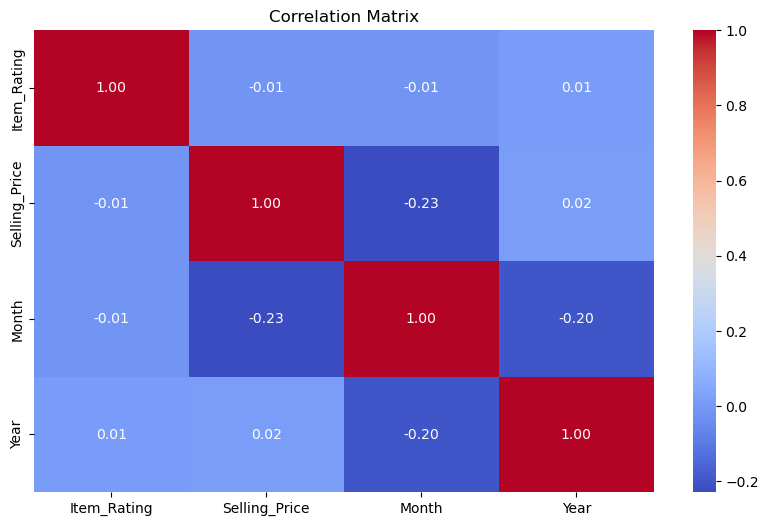
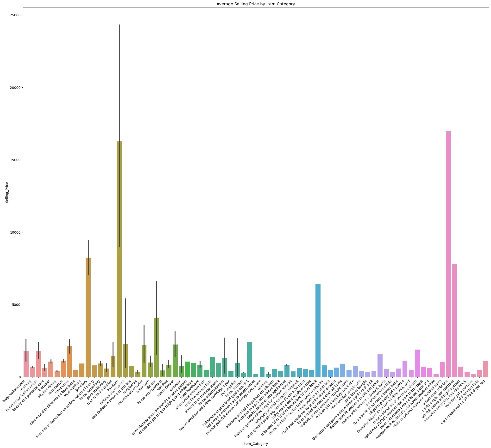
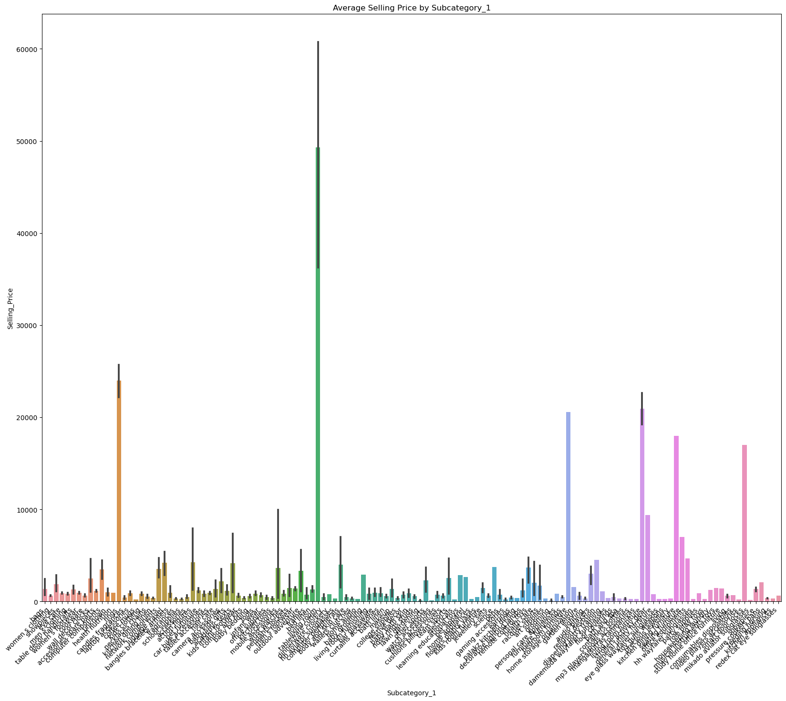
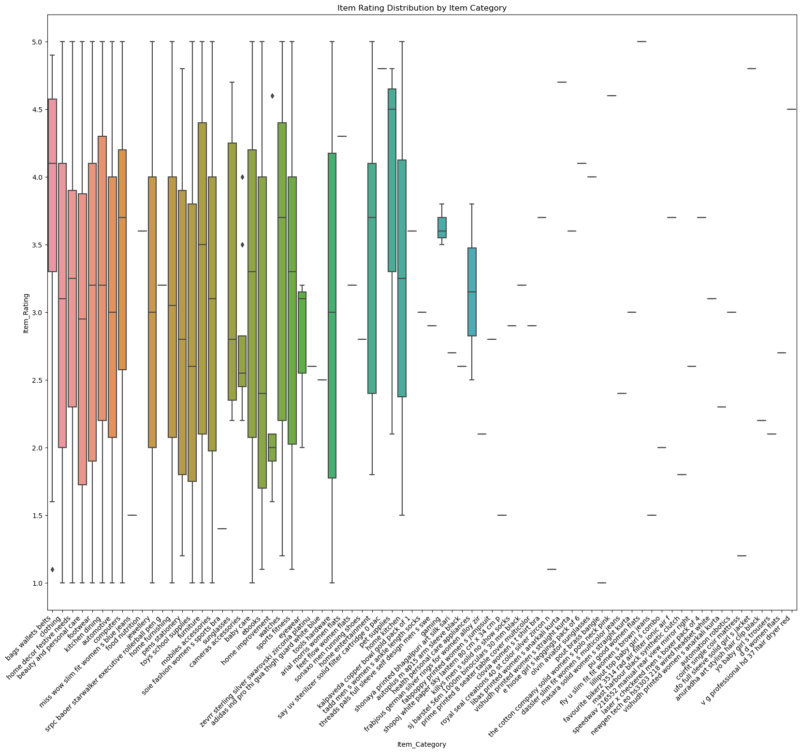
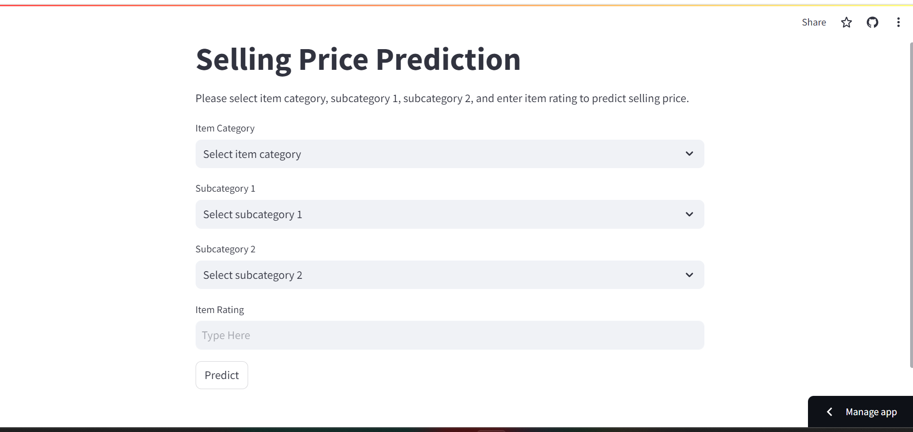
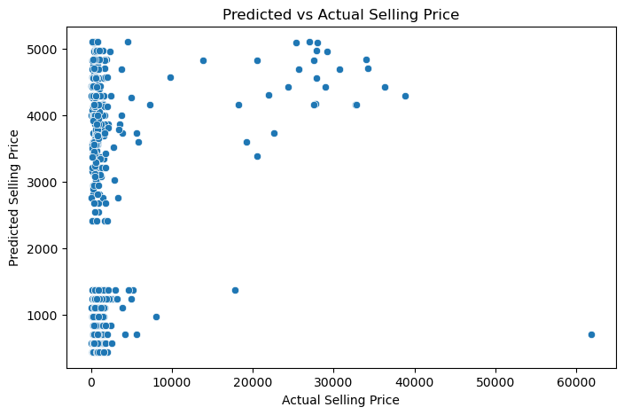

# E-commerce Sales Prediction

**Prepared for UMBC Data Science Master Degree Capstone by Dr. Chaoji (Jay) Wang - SPRING 2024 Semester**

**Author: Ooha Reddy Birru**

GitHub:https://github.com/ooha20

LinkedIn:https://www.linkedin.com/in/ooha-reddy-755b36228?utm_source=share&utm_campaign=share_via&utm_content=profile&utm_medium=ios_app

Powerpoint Presentation File:docs/capstone.ppt

## Background:

### 1. What is it about?

The project revolves around predicting the prices of products on an e-commerce platform. E-commerce platforms have become integral to modern commerce, with a significant impact on consumer behavior. As users increasingly rely on these platforms for purchasing goods, accurately predicting product prices becomes crucial for both consumers and sellers. The project focuses on leveraging machine learning techniques to build a model capable of predicting the selling prices of various products.

### 2. Why does it matter?

E-commerce platforms operate in a highly competitive environment where pricing plays a pivotal role. Predicting product prices accurately can benefit both consumers and sellers. For consumers, it ensures fair and transparent pricing, aiding in making informed purchasing decisions. For sellers, accurate price prediction facilitates optimal pricing strategies, inventory management, and overall business planning. Additionally, a reliable price prediction model contributes to enhanced user experience and customer satisfaction.

### 3. What are your research questions?

- **How do various factors influence the pricing of products on an e-commerce platform?** 
- **Can machine learning models effectively predict the selling prices of products on e-commerce platforms?** 
- **What impact does data preprocessing, feature engineering, and model selection have on the prediction accuracy?** 
- **How does the model performance compare to other regression algorithms or ensemble methods?** 

Addressing these research questions provides a comprehensive understanding of the dynamics influencing e-commerce product pricing and the effectiveness of the chosen machine learning model in this context.

## Data:
### Data Sources:

The datasets used for this project include two CSV files: [Train.csv](https://www.kaggle.com/code/venkatkrishnan/sales-prediction-regression-problem/input) and [Test.csv](https://www.kaggle.com/code/venkatkrishnan/sales-prediction-regression-problem/input), containing information about products on an e-commerce platform.

### Data Size:
- Train.csv: 188.36 kB
- Test.csv: 74.44 kB

### Data Shape:

- Train.csv: 2452 rows, 8 columns
- Test.csv: 1051 rows, 7 columns

### Each Row Represents:

Each row in the dataset represents a specific product on the e-commerce platform. The columns contain various attributes related to the product, such as its ID, brand, category, subcategories, item rating, date of listing, and the selling price.

### Data Dictionary:

Columns in both Train.csv and Test.csv:

1. **Product:** Product ID (Object)
2. **Product_Brand:** Brand of the product (Object)
3. **Item_Category:** Main category of the item (Object)
4. **Subcategory_1:** Subcategory 1 of the item (Object)
5. **Subcategory_2:** Subcategory 2 of the item (Object)
6. **Item_Rating:** Rating assigned to the item (Float)
7. **Date:** Date of listing (Object)
8. **Selling_Price:** Target variable - Price at which the product is being sold (Float)

### Potential Values:

- Categorical columns (Object type) like Product, Product_Brand, Item_Category, Subcategory_1, Subcategory_2 have unique values representing different categories.
- Item_Rating is a float column representing the rating of the product.
- Date is an object column representing the date of listing.
- Selling_Price is a float column representing the target variable.

### Target/Label:

The target variable for the machine learning model is "Selling_Price." The objective is to predict the selling price of a product based on the given features.

### Features/Predictors:

The potential features/predictors for the machine learning models include:

- Product_Brand
- Item_Category
- Subcategory_1
- Subcategory_2
- Item_Rating
- Date (after potential feature engineering)

It's important to note that further exploration and preprocessing may be required to extract meaningful information from the "Date" column for it to be used as a feature. Additionally, techniques like one-hot encoding may be applied to handle categorical variables appropriately.
## Exploratory Data Analysis (EDA)

### Summary Statistics:

**Key Variables:**

- **Item_Rating:**
  - Describes the overall rating assigned to the product.
  - Mean: 3.08
  - Standard Deviation: 1.19
  - Range: 1 to 5

- **Selling_Price:**
  - Mean: $2494.38
  - Standard Deviation: $7115.26
  - Range: $33 to $116289

### Visualizations:

**Histogram:**
- **Distribution of Item Ratings:** The histogram reveals a roughly normal distribution of item ratings, centered around 3.0.
  

  

    

    
    

**Scatter Plot:**
- **Relationship between Item Rating and Selling Price:** The scatter plot indicates a weak positive correlation between item rating and selling price.
  

  

    

    
    

**Line Plot:**
- **Average Selling Price Over the Years:** The line plot demonstrates a general upward trend in average selling prices over the years.

  

    

    
    

**Correlation Matrix:**
- **Correlation between Variables:** There is a weak positive correlation between item rating and selling price.

  

    

    
    

**Bar Plots:**
- **Average Selling Price by Item Category:** Variations in average selling prices across different item categories are displayed in the bar plot.

  

    

    
    

- **Average Selling Price by Subcategory_1:** Differences in average selling prices among subcategories are visualized in the bar plot.

  

    

    
    

- **Distribution of Item Ratings by Item Category:** The box plot illustrates the distribution of item ratings within each category.

  

    

    
    

### Data Cleansing:

**Handling Missing Values:**
- **Missing Values:** No missing values were found in the dataset.

**Handling Duplicate Rows:**
- **Duplicate Rows:** No duplicate rows were identified in the dataset.

### Data Preprocessing:

**Date Column:**
- **Convert to DateTime Format:** The 'Date' column has been successfully converted to datetime format.
- **Extract Features:** Month and year have been extracted from the 'Date' column for further analysis.

**Tidying Data:**
- **Tidy Data Format:** The resulting dataset adheres to the principles of tidy data, with each row representing a single observation and each column representing a unique variable.

## Model Training:

### Linear Regression:

**Definition:** Linear regression is a statistical method used to model the relationship between a dependent variable (target) and one or more independent variables (features).

**How it Works:**
- Linear regression aims to find the best-fitting straight line through the data points to minimize the difference between observed and predicted values.

**Results:**
- Mean Squared Error (MSE) on Validation Set: 42,363,280.96
- Mean Absolute Error (MAE) on Validation Set: 3,133.04
- Root Mean Squared Error (RMSE): 6,508.71

### Support Vector Machine (SVM):

**Definition:** Support Vector Machine (SVM) is a supervised machine learning algorithm used for classification and regression tasks.

**How it Works:**
- SVM aims to find a hyperplane that best separates the data points while minimizing the error in regression tasks.

**Results:**
- Mean Squared Error (MSE) on Validation Set: 48,301,458.11
- Mean Absolute Error (MAE) on Validation Set: 2,104.17
- Root Mean Squared Error (RMSE): 6,949.93

### Random Forest:

**Definition:** Random Forest is an ensemble learning method that builds multiple decision trees during training.

**How it Works:**
- Random Forest builds a forest of decision trees and aggregates their predictions to improve accuracy.

**Results:**
- Mean Squared Error (MSE) on Validation Set: 57,894,723.82
- Mean Absolute Error (MAE) on Validation Set: 3,270.99
- Root Mean Squared Error (RMSE): 7,608.86

## Application of the Trained Model:

I have seamlessly integrated the trained machine learning models into a user-friendly web application using Streamlit, a cutting-edge platform for data visualization and deployment. This interactive interface serves as a powerful tool for making real-time predictions and gaining valuable insights from the trained models.

Users can access the application through a web browser, where they are greeted with a sleek and intuitive interface. By inputting relevant information, such as item features or characteristics, users can receive instant predictions on the selling prices of products on the e-commerce platform.

The application goes beyond simple prediction functionality, offering users a rich set of features and capabilities. It provides visualizations of key insights, such as histograms, scatter plots, and line plots, allowing users to explore the relationships between different variables and gain deeper insights into the data.

Furthermore, the application includes features for data cleansing and preprocessing, empowering users to handle missing values, identify duplicate rows, and preprocess date columns with ease. By ensuring the data is clean and properly formatted, users can trust the accuracy and reliability of the predictions generated by the models.

In addition to its analytical capabilities, the application also prioritizes user experience and accessibility. It is designed with a focus on simplicity and ease of use, making it accessible to users of all skill levels. Whether they are data scientists exploring complex relationships or business stakeholders seeking actionable insights, the application provides a seamless and intuitive experience for all users.

Overall, the Streamlit-powered web application represents a powerful tool for leveraging machine learning models to gain valuable insights and make informed decisions. By combining advanced technology with user-centric design principles, the application empowers users to unlock the full potential of their data and drive meaningful outcomes in their business or research endeavors.

  

    

    
    

## Conclusion:

Based on the results obtained from training and evaluating the models, it is evident that Linear Regression outperforms Support Vector Machine (SVM) and Random Forest in terms of Mean Squared Error (MSE) and Mean Absolute Error (MAE). Therefore, Linear Regression was chosen as the preferred model for predicting the selling prices of products on the e-commerce platform.

  

    

    
    

## Limitations of the Project:

1. Data Quality: The accuracy and reliability of the machine learning models heavily depend on the quality of the data. If the dataset contains errors, outliers, or biases, it can lead to inaccurate predictions and unreliable insights. Therefore, ensuring the quality and integrity of the data is crucial for the success of the project.

2. Feature Selection: The performance of the predictive models may be influenced by the choice of features used for training. In this project, the selection of features such as item rating, month, and year may not capture all relevant factors that affect selling prices. Incorporating additional features or refining the feature selection process could improve the model's accuracy and predictive power.

3. Model Assumptions: Linear regression and other machine learning algorithms make certain assumptions about the underlying data distribution and relationship between variables. If these assumptions are violated, it can affect the validity of the model and the accuracy of its predictions. It's essential to carefully evaluate the model assumptions and assess their implications for the project.

4. Generalization: The trained models may have limited generalization capability, meaning they may perform well on the training data but struggle to make accurate predictions on unseen data. Overfitting, where the model captures noise or patterns specific to the training data but fails to generalize to new data, is a common issue that needs to be addressed. Techniques such as cross-validation and regularization can help mitigate overfitting and improve the model's generalization ability.

5. Interpretability: While machine learning models like linear regression provide insights into the relationship between variables, they may lack interpretability compared to simpler models. Understanding how the models arrive at their predictions and explaining their findings to stakeholders can be challenging, especially for complex models like random forests. Ensuring transparency and interpretability of the models' decisions is essential for building trust and confidence in their predictions.

6. Deployment Challenges: Deploying machine learning models into production environments can present technical challenges, including scalability, performance optimization, and integration with existing systems. Ensuring the smooth deployment and operation of the models in real-world settings requires careful planning, collaboration with IT teams, and ongoing maintenance and monitoring.

Addressing these limitations requires a systematic approach to data collection, feature engineering, model development, and deployment. By acknowledging these challenges and taking proactive steps to mitigate them, the project can achieve its objectives and deliver valuable insights and predictions to stakeholders.

## Lessons Learned:

1. Importance of Data Exploration: This project highlighted the critical role of exploratory data analysis (EDA) in understanding the dataset's characteristics, identifying patterns, and uncovering insights. Investing time in thorough data exploration helped in selecting relevant features, detecting anomalies, and making informed decisions throughout the project lifecycle.

2. Model Evaluation Techniques: Evaluating the performance of machine learning models requires a nuanced understanding of various metrics such as Mean Squared Error (MSE), Mean Absolute Error (MAE), and R-squared (R^2). Experimenting with different evaluation techniques helped in selecting the most appropriate model for the task and interpreting the results effectively.

3. Feature Importance and Selection: Feature selection is a crucial step in model development, as it directly impacts the model's predictive power and generalization ability. This project emphasized the importance of identifying and selecting the most relevant features while discarding irrelevant or redundant ones, thereby improving the model's performance and interpretability.

4. Model Deployment Challenges: Deploying machine learning models into production environments involves overcoming technical, operational, and organizational challenges. From optimizing model performance to integrating with existing systems and ensuring scalability and reliability, deploying models requires careful planning, collaboration, and continuous monitoring.

5. Interpretability vs. Complexity Trade-off: Balancing model complexity with interpretability is essential, especially when dealing with stakeholders who may not have a deep understanding of machine learning concepts. Simplifying complex models and providing intuitive explanations for their predictions can enhance trust, adoption, and usability.

6. Iterative Development Process: Adopting an iterative and agile approach to model development allowed for continuous improvement, feedback incorporation, and adaptation to changing requirements. Embracing flexibility and iteration facilitated the discovery of insights, refinement of models, and ultimately, the delivery of value to stakeholders.

7. Communication and Collaboration: Effective communication and collaboration among team members, domain experts, and stakeholders are paramount for project success. Clear communication of goals, progress, and findings, along with active collaboration in problem-solving and decision-making, fosters alignment, engagement, and shared ownership of outcomes.

By reflecting on these lessons learned, future projects can benefit from improved processes, better decision-making, and ultimately, greater success in achieving their objectives.

## Future Scope:

1. Model Enhancement: Continuously refining and enhancing the machine learning models based on new data, updated features, and improved algorithms can further improve prediction accuracy and robustness. Incorporating advanced techniques such as ensemble learning, deep learning, or hybrid models may yield better results.

2. Real-time Prediction: Integrating the predictive models into a real-time system capable of handling incoming data streams can enable timely and automated predictions. This can be particularly useful in dynamic environments where quick decision-making is critical, such as financial markets or healthcare settings.

3. Feature Expansion: Exploring additional features or data sources beyond the current scope can enrich the predictive models and uncover new insights. For example, incorporating demographic information, socio-economic indicators, or behavioral data may provide a more comprehensive understanding of the factors influencing the target variable.

4. Deployment in Other Domains: Applying the developed models and analytical framework to other domains or industries with similar prediction tasks can broaden the project's impact and relevance. For instance, the predictive models trained on e-commerce data may be adapted for pricing optimization in retail or demand forecasting in supply chain management.

5. User Interface Enhancements: Continuously improving the user interface of the deployed application to enhance user experience, accessibility, and functionality can increase adoption and user satisfaction. Incorporating interactive visualizations, personalized recommendations, and intuitive navigation features can make the application more engaging and user-friendly.

6. Performance Monitoring and Feedback: Implementing robust monitoring mechanisms to track model performance, detect drifts or anomalies, and gather user feedback can facilitate ongoing optimization and maintenance. Regularly reviewing model outputs, soliciting user input, and incorporating domain expertise can ensure that the predictive system remains accurate, reliable, and aligned with stakeholders' needs.

7. Ethical Considerations and Bias Mitigation: Proactively addressing ethical considerations, fairness, and bias in the predictive models by conducting thorough audits, implementing fairness-aware algorithms, and ensuring transparency and accountability in decision-making processes. Upholding ethical principles and mitigating potential biases can enhance trust, credibility, and social impact.

By exploring these avenues for future development and expansion, the project can continue to evolve, adapt, and deliver value in addressing real-world challenges and opportunities in predictive analytics and machine learning.

## References

- https://www.ibm.com/topics/linear-regression#:~:text=Linear%20regression%20analysis%20is%20used,is%20called%20the%20independent%20variable.

- https://builtin.com/data-science/random-forest-algorithm

- https://scikit-learn.org/stable/modules/svm.html

- https://medium.com/analytics-vidhya/mae-mse-rmse-coefficient-of-determination-adjusted-r-squared-which-metric-is-better-cd0326a5697e

